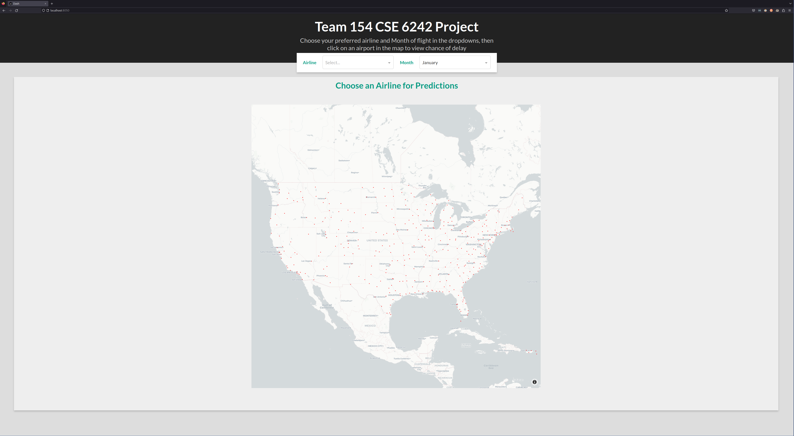
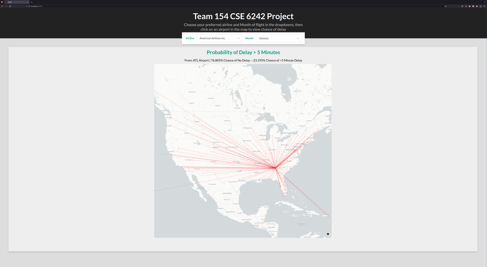

# CSE6242 Project
Team 154 Project for CSE6242

# How to use

### Setup
1. Create virtual environment (should only need to do once):  
    `python -m venv ./venv`  (or `python3`)  

2. Activate virtual environment (do each session)  
Windows: `source ./venv/Scripts/activate`  
Linux: `source ./bin/activate`

3. install packages (do at start, and when requirements.txt changes)  
$`pip install -r ./requirements.txt`  

### Running the Application

1. From the root of the project run:
`python main.py` (or `python3`)
2. Navigate to [localhost:8050](http://localhost:8050) in your browser to view the page.

The map below should be displayed:

Choose the airline and preferred month of travel from the drop down menus, then select the airport on the map to display flight
paths to connecting airports along with probability of delay.



<p style="text-align: center; font-size: 13px; margin: auto;"><i>American Airlines Delay Probability from ATL</i></p> 


# Get Data

If you want to download the full [dataset](https://www.kaggle.com/datasets/robikscube/flight-delay-dataset-20182022), run the helper script below after authenticating through kaggle's API.

#### Note on kaggle api use:
```
In order to use the Kaggle’s public API, you must first authenticate using an API token. From 
the site header, click on your user profile picture, then on “My Account” from the dropdown 
menu. This will take you to your account settings at https://www.kaggle.com/account. Scroll 
down to the section of the page labelled API:

To create a new token, click on the “Create New API Token” button. This will download a fresh 
authentication token onto your machine.

If you are using the Kaggle CLI tool, the tool will look for this token at ~/.kaggle/kaggle.json 
on Linux, OSX, and other UNIX-based operating systems, and at 
C:\Users<Windows-username>.kaggle\kaggle.json on Windows. If the token is not there, an error 
will be raised. Hence, once you’ve downloaded the token, you should move it from your Downloads 
folder to this folder.
```
Once you have the json file in place, from root of project run:  

`python ./src/data/get_data.py`

It may take a few minutes due to file size.  

# Project Structure:
```
├── .gitignore  
├── README.md  
├── data  
│   ├── processed       cleaned data ready for visualization  
│   └── raw             raw data files  
├── requirements.txt      
├── src                 code  
│    ├── EDA            code to do exploratory stuff  
│    ├── data           code to pull/clean data  
│    ├── model          ml models etc.  
│    └── viz            code to visualize data  
└── tests               tests      
```
